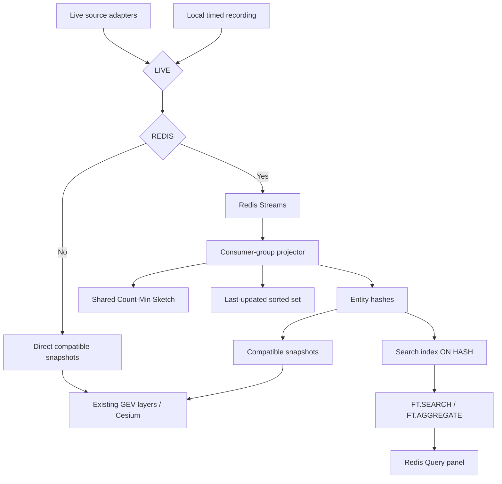

# GEV Redis Demo — MVP Specification

**Status:** Spec phase; implementation has not started.  
**Goal:** Adapt original GEV with minimal changes to demonstrate **ingest → Redis Streams → projection → hashes → map → Redis queries**, live or offline.  
**Scope:** Civilian flights, military flights, AIS vessels. Bento is excluded completely.  
**Baseline:** `bilawalsidhu/gods-eye-view`. Choose between the previously proposed `759652207fd1279ece97f0f19af566feb9a82146` and inspected local `65bc522f49dc1166eca533996be8e789ad36cfe5` before implementation.

This consolidated specification replaces the earlier drafts and amendments. Requirements below are adopted; unresolved choices and review recommendations are isolated in §12.

## 1. Two toggles, four paths

**LIVE** selects live sources or a recorded scenario. **REDIS** selects direct GEV data or Redis-backed data.

| LIVE | REDIS | Map data path | New Redis Query panel |
|---|---|---|---|
| Yes | No | Live providers → original proxy responses → GEV | Hidden |
| Yes | Yes | Live providers → Streams → projector → hashes → snapshots → GEV | Available when ready |
| No | No | Timed recording → local current-state adapter → snapshots → GEV | Hidden |
| No | Yes | Timed recording → Streams → projector → hashes → snapshots → GEV | Available when ready |

Defaults: **LIVE Yes, REDIS No**, the original GEV experience. LIVE No is visibly labeled RECORDED and requires no internet. REDIS No requires no Redis connection.

With REDIS Yes, scoped map objects come from hashes; direct source responses cannot bypass Redis. GEV still owns rendering, interpolation, browser render caches, tracking, selection, and trails. Original Contacts/analyst interactions remain intact where their dependencies are available. Only the new Query panel demonstrates `FT.SEARCH` / `FT.AGGREGATE` execution.

## 2. Architecture and change boundary



Run GEV, one Node bridge, and one Redis instance. The bridge owns session controls, recording/replay, projection, snapshots, and query APIs. Reuse existing Vite source middleware through small server-safe seams.

| Existing area | Required treatment |
|---|---|
| `vite.config.js` source adapters | Reuse credentials, upstream caching, fallback, rate limits; expose one refresh owner |
| `flights.js`, `militaryFlights.js`, `aisLiveVessels.js` | Adapt fetch/snapshot boundaries and reset hooks; retain reconciliation/rendering |
| `DataLayerManager`, tracking, camera, terrain, trails | Preserve normal behavior; no per-frame Redis calls |
| Contacts and analyst engine | Keep current logic; Redis mode makes scoped render caches hash-derived |
| New UI | Two switches, scenario/recording controls, Query panel, compact Redis details |

No other Redis-backed layers, natural-language query translator, general ingestion platform, cluster/HA deployment, RedisJSON requirement, separate GEO index, or renderer rewrite. Remove Bento runtime/config/scripts/docs and its integration hooks selectively, preserving unrelated local work.

## 3. Sources and snapshot contract

| Layer | Source / identity | Existing cadence | Source freshness window |
|---|---|---|---|
| Civilian | OpenSky, regional adsb.lol fallback / lowercase ICAO24 | 30 s refresh | 180 s |
| Military | adsb.lol military / lowercase ICAO24 | 15 s refresh | 120 s |
| Vessels | AISStream / MMSI string | Events on arrival; 60 s browser snapshots | 300 s |

When REDIS Yes, one refresh owner continues calling the same live adapters even though the browser reads hashes. Avoid a second upstream poller; keep one AIS connection. Preserve viewport/anchor demand and actual provider coverage. LIVE No stops external feeds, reconnect callbacks, and enrichment. Recording taps accepted observations independently of REDIS and never adds polling.

Snapshot adapters restore the payload/types expected by existing GEV layers. Include session/epoch, source timestamps, coverage, and completeness metadata. Read only active-session hashes when REDIS Yes. Translate Redis `vessels` to GEV `ais-live-vessels`; keep stable IDs for focus/navigation and existing civilian/military suppression for rendering.

Hash positions are source observations; displayed positions may be interpolated. Search radius means surface distance, not exact parity with GEV's 3D distance. Do not promise identical counts near a boundary. Preserve source units and available enrichment; missing operator/class/route data stays unknown. Exact snapshot scope, pagination, and cohort precedence remain design gates in §12.

## 4. Event and Redis data model

One event represents an accepted source position observation, never a rendered frame.

| Fields | Contract |
|---|---|
| `schemaVersion`, `layer`, `entityType`, `entityId`, `observationId` | Version 1; stable identity and repeatable source-observation identity |
| `sessionId`, `runId`, `modeEpoch` | Server-owned lifecycle scope |
| `observedAt`, `ingestedAt` | Source time and actual local receipt/publication time, epoch ms |
| `lat`, `lon`, `altitudeM`, `speed`, `speedUnit`, `headingDeg` | Valid source coordinates; nullable optional values; aircraft m/s, vessels knots |
| `source`, `coverage`, `payload` | Actual provider/coverage and small source-specific metadata |

Source time does not become fresh on a cache read. Replay retains original timestamps and applies the explicit mapping in §8. No Cesium objects, secrets, or authorization headers enter events.

For each session and layer, use these keys (flights shown):

```text
gev:session:<sessionId>:{flights}:events
gev:session:<sessionId>:{flights}:entity:<icao24>
gev:session:<sessionId>:{flights}:lastupdated
gev:session:<sessionId>:{flights}:update-frequency
gev:session:<sessionId>:{flights}:projector:errors
```

Each entity is a native hash (`HSET`) containing canonical fields, available display/query metadata, `projectedAt`, `freshUntil`, and `location="lon,lat"`. Omit missing numeric values; remove obsolete optional fields unless a defined sticky-enrichment rule applies. Adapters restore JS nulls/types. Map snapshots, selected details, and Search reference these same hashes.

Create one active-session Search index **ON HASH** covering the three entity prefixes:

| Index type | Candidate fields; retain only those needed by query presets |
|---|---|
| TAG | entityId, layer, entityType, source, coverage, military, onGround, aircraftClass, shipType |
| TEXT | label, callsign, name, operator, destination, originCountry |
| NUMERIC | altitudeM, speedMps, speedKts, verticalRateMps, observedAt, freshUntil |
| GEO | location |

Configure sorting/grouping fields for actual presets. Exact IDs use TAG matching; text follows Redis token/phrase semantics. Do not compare aircraft/vessel speeds without a common unit. Search GEO supplies spatial queries; the sorted set below supplies update ordering and cleanup.

## 5. Projection, freshness, and frequency

Create group `gev-projectors` before intake on each active stream. Use bounded batches, dedicated blocking-read connections, startup/periodic pending recovery, and acknowledgment after completed handling.

For a valid, fresh position newer than current `observedAt`, perform a guarded layer-local projection:

1. Write the hash with `freshUntil = observedAt + freshness window`; expire at that deadline.
2. `ZADD ...:lastupdated observedAt entityId`.
3. `CMS.INCRBY ...:update-frequency entityId 1`.
4. Acknowledge after all projection effects succeed.

Duplicate, equal-time, older, or already-stale observations change neither current position nor frequency. Metadata-only changes are outside this position counter. Invalid events enter the bounded error stream before acknowledgment. Completed projection followed by a crash before `XACK` must be safe to replay without another increment.

**Last updated** means latest accepted source observation time. `projectedAt` separately measures processing latency. Sweep stale members every 30 s, atomically rechecking freshness before removal/deletion. All read/query paths enforce `freshUntil > evaluatedAt`; expiration alone is insufficient.

**Count-Min Sketch:** one shared sketch per layer/session, with entity IDs as items, as confirmed by the user. Initialize once using `CMS.INITBYPROB`; read selected entities with `CMS.QUERY`. Display **Approx. accepted updates: N**, scoped to the session/run. This is cumulative accepted position-update frequency, not unique entities, fleet size, or an exact event ledger. Collision error can overestimate frequency. Bootstrap counts once; Redis-off observations do not count; entity expiry does not subtract. Recovering the same session retains its sketch; a new session/replay starts a new sketch.

Prevalidate data, key types, and structures before the atomic projection operation. Runtime failures do not provide rollback: uncertain partial projection must stop affected processing and remain unacknowledged until repaired or the run is explicitly invalidated. Do not claim exactly-once delivery. The repair policy is a blocking refinement in §12.

## 6. Redis Query UI and APIs

Show the new panel only with REDIS Yes, and reject its API calls server-side when off. Display Preparing/Unavailable while dependencies are unready. Use local structured controls, without an LLM:

- Layer, text, numeric, and radius filters; search or a small aggregation selector.
- Run/reset; real result rows or aggregate buckets; focus/highlight by stable entity ID.
- Coverage, evaluation time, latency, total versus returned matches, pagination/truncation, and errors.
- Optional expandable generated-command preview and entity details showing hash, CMS estimate, and last update.

Compile structured requests into allowlisted `FT.SEARCH` or `FT.AGGREGATE` commands. Execute freshness/session/layer/scope filters over indexed data before pagination, not over a capped browser snapshot. Escape/bind values appropriately; never accept arbitrary commands, keys, index names, paths, URLs, or aggregation expressions. Initially bound radius to 500 km; finalize page/bucket/time/concurrency limits in §12.

Candidate presets: fresh aircraft within 250 km above a chosen altitude (`FT.SEARCH`), and aircraft grouped by class or source (`FT.AGGREGATE`). Counts describe ingested fresh coverage. Cross-cohort totals must deduplicate ICAO24 or explicitly say source-cohort records; final semantics remain open. Unknown metadata is not fabricated.

Read APIs provide compatible snapshots, entity details/frequency, and health. `POST /api/redis/query` is read-only despite its HTTP method. Separate narrow control APIs manage switches, capture, and registered scenarios using existing local/same-origin protections; credentials stay server-side.

Results highlight/focus map entities without automatically replacing the globe dataset. Load a result's hash if absent from the current snapshot; aggregate buckets are not map entities. Verify a projected sample is Search-visible before declaring query readiness. Map and Search reads are not a transactional snapshot: expose evaluation times and test fixed replay checkpoints.

## 7. Session transitions and failures

One server-owned state is shared by demo tabs. Each transition advances an epoch, cancels old requests/producers, and rejects late responses. Reset scoped render/Contacts/query/follow-up caches and stale selections through minimal lifecycle hooks.

| Transition | Required behavior |
|---|---|
| REDIS No → Yes | New namespace; provision groups/sketch/index; bootstrap fresh selected-source state; show Preparing until hash snapshots are ready |
| REDIS Yes → No | Stop publication for that session; restore selected-source direct snapshots; hide/clear Query panel |
| LIVE Yes → No | Finalize capture; stop external feeds/enrichment; validate/select recording; start it using current REDIS setting |
| LIVE No → Yes | Stop replay; restore one live refresh owner using current REDIS setting |
| REDIS changes during replay | Restart the same scenario at its beginning; explain this in the switch control |

Live recording may continue across REDIS switches. Separate Redis namespaces/indexes isolate sessions/runs; cleanup touches only owned inactive data, never a database flush.

With REDIS Yes, failures stay visible; never silently render direct data. The user can explicitly turn REDIS off. Search-only failure may leave hash rendering active with Query unavailable. LIVE No never falls back to live sources. Missing scenarios or offline assets produce explicit errors. Detailed pending/failed transition behavior is a refinement in §12.

## 8. Recordings and genuinely offline playback

Controls: named Start/Stop recording while LIVE Yes; scenario selector, Start/Restart, elapsed/duration, capture provenance, and Preparing/Playing/Finished/Error while LIVE No. Include a compact cue list with optional focus/query actions. MVP playback is 1×; pause, seek, speed changes, automatic looping, and scenario editing are deferred.

Capture accepted canonical observations with bounded asynchronous file writes, independent of Redis retention. Report dropped writes/gaps and mark incomplete captures. A reusable package contains:

| File | Contents |
|---|---|
| `manifest.json` | Schema/version, ID/title, capture dates/duration, region, layers/providers/coverage, initial camera/subject, bootstrap/gaps, counts/checksums, required local assets |
| `observations.ndjson` | Original observations plus arrival-relative `offsetMs` and monotonic `sequence` |
| `context.json` | Available metadata and local reference records needed by the scenario |
| `cues.json` | Relative times, presenter notes, entity/query actions, expected results/tolerances |

Validate registered scenario IDs and packages before replay. Seed explicitly labeled fresh opening records; never preload future observations. Both REDIS settings consume the same ordered schedule through their selected destination. Query cues require REDIS Yes; expected answers are notes, never substituted results.

At 1×, shift source timestamps by `replayStartEpochMs - captureStartEpochMs`, preserving source age and event spacing. Store `originalObservedAt`/`originalIngestedAt`; use actual publication time for `ingestedAt`. Carry scenario/run provenance and shift all timestamp fields used by rendering consistently. Prepare bootstrap/destination before starting presenter time; specify the exact clock boundary in §12. At completion stop emission, show Finished, allow normal expiry, and offer Restart with a new run/epoch.

Offline means cold startup with external networking blocked and empty browser caches. Prepare dependencies/container images in advance; runtime cannot install or pull. Serve Cesium, fonts/icons/models/reference data locally. Supply basic local imagery/boundaries or a plain globe with ellipsoid terrain. Disable cloud maps/terrain, unrelated live layers, external enrichment, voice, and LLM calls. The new structured Redis queries execute locally. Both recorded combinations must work; direct recorded mode requires no Redis.

## 9. Operations and limits

Use one pinned Redis build supporting Streams, hashes, sorted sets, Search, and CMS. Capability-check it at setup. Package GEV/bridge/Redis with one prepared startup command, preserving original GEV development. Mode defaults seed server state, not independent client flags:

```text
GEV_DEMO_LIVE=true
GEV_DEMO_REDIS=false
GEV_DEMO_SCENARIO=
GEV_DEMO_SCENARIO_DIR=./scenarios
REDIS_URL=redis://localhost:6379
```

Initial tuning defaults, subject to measurement:

| Setting | Default |
|---|---|
| Stream retention target | Approx. 250,000 entries/layer |
| Publish deadline | 500 ms |
| Projector batch / blocking read / claim idle | 500 / 2 s / 30 s |
| Stale sweep | 30 s |
| CMS error / probability | 0.001 / 0.01 |

Expose these as server settings, with source freshness windows from §3. Bound publisher batches, queued bytes/events, retries, and disk writes. A timeout is not queue cancellation. Report drops/gaps instead of growing memory indefinitely. Retention is a rolling entry budget, not a guaranteed duration; do not promise recovery of trimmed pending events. Set the actual memory/recovery budget in §12.

Health distinguishes source, publication, projection, Search, and rendering. Report active mode/session/scenario, coverage, Stream length/lag/pending, publish errors/drops, accepted/ignored/invalid events, hash/ZSET counts, sweeps, selected CMS estimate, and query/snapshot age/latency. Use structured rate-limited logs. A successful Redis PING alone is not readiness.

## 10. Delivery order

1. **Baseline:** select commit; selectively remove Bento; capture source/renderer contract fixtures.
2. **Vertical slice:** one aircraft layer through Streams → hash/ZSET/CMS → map, with one Search and one aggregation.
3. **Modes/offline:** one deterministic recording exercises all four combinations and mode transitions.
4. **Complete MVP:** all three layers, recording controls, chosen query presets, offline assets, and a rehearsed scenario.

No implementation begins during the spec phase. The first slice is an implementation milestone, not a reduction of the agreed final scope.

## 11. Acceptance and verification

- [ ] All four combinations work; direct modes need no Redis; recorded modes make no external requests.
- [ ] Trace a known observation through Stream/group/hash into the actual map snapshot and real Search result.
- [ ] REDIS Yes never bypasses hashes; Query is gated in both UI and backend and executes Search/Aggregate against the same hashes.
- [ ] Source contracts preserve IDs, units, timestamps, provenance, nulls, and renderer behavior; check tracking, trails, selection, and interpolation.
- [ ] Fixed-scenario queries/aggregations match defined exact results; coverage, pagination, unknowns, and cross-cohort identities are explicit.
- [ ] Duplicate/older/stale input cannot roll back state or inflate accepted-update counts; CMS is evaluated as an estimate, not an exact count.
- [ ] Test crash after projection/before acknowledgment, partial projection failure, pending recovery, reconnect, index readiness, expiry, and concurrent cleanup/update.
- [ ] Switches during in-flight requests cannot mix sessions; failures remain visible without implicit fallback.
- [ ] Capture/restart reproduces order and cue results within measured timing/position tolerances; incomplete packages cannot look successful.
- [ ] Cold-cache offline startup succeeds from prepared local artifacts, and original GEV regression checks pass.
- [ ] Bounded memory/recovery behavior and latency targets are demonstrated at the agreed scenario scale; Bento is absent.

## 12. Critical refinements before implementation

The architecture is settled. The following contracts need decisions; recommendations are not additional adopted scope.

| Priority | Missing or underspecified | Recommended refinement |
|---|---|---|
| Blocking | **Map snapshot contract:** payload compatibility alone does not define global/viewport coverage, completeness, deletions, pagination, or newly queried entities. | Define one request/response fixture per layer, snapshot scope and revision, missing-entity semantics, caps, and selected-entity loading. Keep both recorded adapters behaviorally equivalent. |
| Blocking | **Projection failure repair:** hash version guards can skip a missing ZSET/CMS effect after partial failure; a cumulative CMS cannot be reconstructed from current hashes alone. | For this demo, prefer invalidating/restarting an uncertain run visibly over building a general repair ledger. Confirm that boundary while preserving ordinary crash-before-XACK recovery. |
| Blocking | **Query meaning and aircraft identity:** the same ICAO24 can exist in both source cohorts; browser enrichment may be unavailable to Search. | Choose two or three precise queries first, list required source-backed fields, and define one cohort/identity policy shared by query counts and focus behavior. |
| Before rehearsal | **Mode and replay clock edges:** requested versus active mode, preparation failure, valid empty feeds, bootstrap age, fast repeated switches, and process restart are unspecified. | Write a small state-transition table with ready/failed/empty states; choose one replay clock boundary and restart/resume policy. Do not interpret zero entities as failure. |
| Before rehearsal | **Demo scale and success targets:** no measured fleet size, capture length, acceptable lag, page/queue budget, or recovery duration. | Choose the first region/subject/scenario, pin Redis and baseline, then set explicit limits and latency/retention targets for that workload. Preserve normal source cadence when defining visible latency. |

References: [Redis Search index](https://redis.io/docs/latest/commands/ft.create/), [FT.SEARCH](https://redis.io/docs/latest/commands/ft.search/), [FT.AGGREGATE](https://redis.io/docs/latest/commands/ft.aggregate/), [Count-Min Sketch](https://redis.io/docs/latest/develop/data-types/probabilistic/count-min-sketch/), [Lua scripting](https://redis.io/docs/latest/develop/programmability/eval-intro/).
